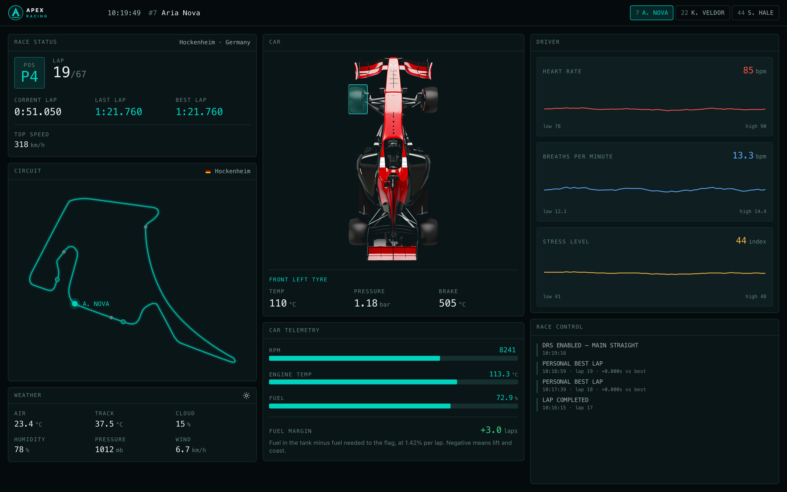

# Apex Racing, Race Control

Live race control screen for an F1 race engineer. No backend. Every number comes
from a simulator running in the browser.

Live: https://apex-race-control.vercel.app/

[](https://youtu.be/D3z7ruE-GEs)

Walkthrough video: https://youtu.be/D3z7ruE-GEs

## 1. How to run

```sh
pnpm install
pnpm dev
```

http://localhost:5173. Node 20+, pnpm 9+. `npm install && npm run dev` works too.
No env vars, no keys, nothing to configure.

`pnpm build && pnpm preview` for the production build.

## 2. Overview

One driver at a time. The car sits in the middle because it is the thing you
interact with, and its four tyres are clickable for temperature, pressure and
brake temperature. Race position and the circuit on the left, driver vitals and
the race control feed on the right. A simulator ticks every 700ms and pushes new
values into all of it. Three drivers, and the whole board follows the one you
pick.

## 3. Architecture

```
src/
  sim/          the race, in plain TypeScript, no React
    types.ts      the snapshot shape the UI reads
    signals.ts    drift, the corner model, time formatting
    events.ts     severity levels and threshold alarms
    engine.ts     tick loop, drivers, rivals, weather
  state/        provider and the useRace selector hook
  components/   one panel per area of the screen
  data/         seed drivers, and the racing line as a path string
```

The simulation does not know React exists. `createRaceEngine()` holds mutable
state, advances it on a timer, and swaps one snapshot object per tick. React
reads it through `useSyncExternalStore`:

```ts
const rpm = useRace((s) => s.driver.rpm)
```

Components pick the value they need, so a tick re-renders the panels whose
numbers changed rather than the app.

The catch: a selector must return a primitive or something already on the
snapshot. Build a new object inside one and React compares it with `Object.is`,
never matches, and re-renders forever.

## 4. Live data simulation

Tick is 700ms. One tick is six seconds of race time, so a lap takes about 14
seconds to watch instead of 83.

Nothing jumps. Values chase a target with `drift(current, target, rate)` plus a
little noise, and the rate is how fast that channel reacts. Speed is 0.6, tyre
temperature is 0.045, because a tyre takes time to heat up.

The targets come from one function. `corneringAt(lapProgress)` is 0 on a straight
and 1 mid corner. Corner positions were measured off the racing line in
`data/trackPath.ts` by sampling the path and taking the turning angle per unit
length. Throttle drops in corners, speed follows throttle, RPM follows throttle,
tyre and brake temperatures rise with cornering load. Everything moves together
because everything reads the same number.

Lap progress comes out of speed, so a lap time is a result rather than a constant.

Divergence is built in. Each tyre has a bias, front left highest because the lap
is right hander heavy, and each driver has an aggression factor on top. Under
braking there is a small chance per tick of a lockup on a front corner, which
spikes that tyre 14 to 26 degrees along with the brake and then recovers on its
own. Fuel only goes down.

Events mostly come out of state. `events.ts` holds the thresholds, the driver is
checked against them every tick, and an alarm fires once on crossing and cannot
fire again until the value drops under a lower clear level. Without that
hysteresis a tyre sitting at 118 degrees posts an event every tick and buries
everything else. Lap completions come from the lap timer. Yellow flags and DRS
are random and belong to the session, so they stay visible whichever driver is
selected.

Severity is about what the engineer does. Info means it happened, caution means
watch it, critical means act now.

Every driver has their own history buffers, filled every tick whether selected or
not, so switching remaps the board to that driver's real history instead of
clearing it.

## 5. Responsive strategy

| Width | Layout |
|---|---|
| 1280+ | Three columns, fixed to the viewport height. Nothing on the page scrolls. Race control takes the leftover height in its column and only its list scrolls. |
| 1024 to 1279 | Two columns. Vitals and race control drop to a full width row below, split in two so the charts do not stack. Page scrolls. |
| Below 1024 | One column, and the order changes. Car first, because on a phone it is what you touch. Status strip pinned to the header carries position, lap, driver and fuel margin. |

`min-w-0` on every column. Without it a long event line pushes its grid track
wider than its share and the page scrolls sideways, which is what breaks at
widths like 1217.

## 6. Challenges and pitfalls

**Three drivers, one lap time.** Everyone posted 84.000 every lap, and last lap
always matched best lap. Speed depends on track position and position is worked
out from speed, so stepping a whole 4.2 second tick at once locked laps onto a
whole number of ticks. A 1.2 percent pace difference is smaller than a tick, so
it vanished. Motion is now integrated in four steps per tick and the line
crossing is interpolated. Found it by reading the screen, not the code.

**A 41 second best lap.** Cars start part way through a lap, so the first
crossing timed a fraction of a lap and wrote it to best. First crossing now only
moves the counter.

**Charts that never moved.** History buffers are pushed and shifted in place, so
the snapshot handed React the same array identity every tick. It copies them now.
The driver object has the same problem and the opposite fix, read numbers off it
rather than the object.

**Corner model did not match the track.** I wrote corner positions by hand before
there was a map. With markers on the racing line, five of nine sat on straights,
so the car braked mid straight and ran flat out through the stadium section.
Sampled the path and replaced the guesses.

**The feed grew the page.** I gave the list `h-full` to fill its panel. A
percentage height needs a parent with a real height, the grid row was sized by
content, so it resolved to auto and grew forever. The fix was the shell, not the
list.

**Car was too tall.** Art is 800 by 1836, so sizing by width made it 666 pixels
tall at 290 wide and pushed telemetry off a laptop screen. Height drives it now.

## 7. Trade-offs

Response rates in the simulation are per tick, not per second. Fine at a fixed
700ms, but the physics are tied to the tick, so the faster telemetry mode in the
bonus list would make every value react differently and the car would behave like
a different car. The fix is time constants and passing elapsed time in, about
twenty minutes across a dozen call sites. I spent that time on the tyre
interaction and the responsive work instead.

No pit stops either, so fuel margin can go negative and stay there. Correct as a
warning, not usable as strategy.

## 8. Performance notes

- Simulation runs outside React, components subscribe to single values, so a tick
  only re-renders what changed
- Charts hold a fixed 60 point window with animation off, since the series is
  replaced every tick and animating each replacement means the line never settles
- Fixed y axis domains, so the scale does not jump under the line
- No virtualisation, the longest list is 20 rows
- No memoisation, props change every tick anyway so the comparison is wasted work

The cost is Recharts. It puts the bundle over 500kb and renders six chart
instances per tick, three of which are single value bars that a div would draw
for free. I knew that before submitting and left it, because the line charts earn
the library and the bars are cheap to swap later. The car PNG is another 1.2MB
and could be WebP, but re-encoding a supplied asset felt like the wrong call.

## 9. Tools used

Vite 8, React 19, TypeScript, Tailwind v4, Recharts, pnpm, Prettier.

Tailwind is set up with the palette and spacing as tokens in `src/index.css`, so
no component writes a raw colour. Supplied assets are used as they came, except
the racing line, which is inlined as a path string so marker positions can be
read off a mounted SVG path with `getPointAtLength`.

I used an AI assistant throughout, the way I would use a pair. The simulation
module leaned on it most. Getting believable telemetry out of a lap model is more
maths than frontend, and I wanted my hours going into the interface. I drove the
model, set the rules it had to follow (load comes from where the car is on the
lap, values chase targets instead of jumping, events come from thresholds rather
than a list), reviewed what came back, and checked it against the screen. Most of
the bugs in section 6 are ones I spotted by watching the dashboard and then
traced. The layout, the interaction model and the structure of the app are my
calls, and I can walk through any file here.
